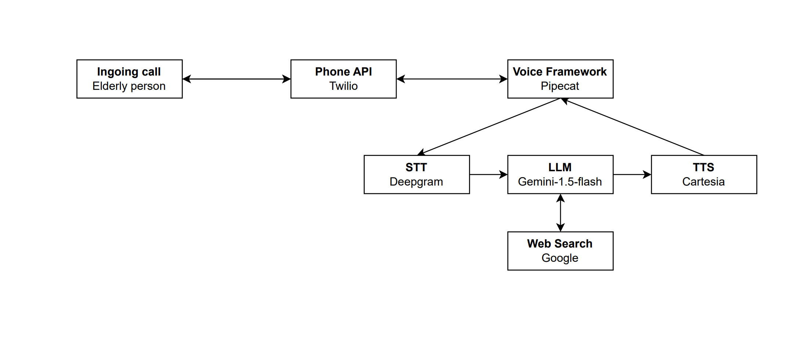

# Bot / CallAgent
The bot implementation is based on the [example](https://github.com/pipecat-ai/pipecat-examples/tree/main/twilio-chatbot/inbound) of pipecat.
A detailed explanation, how to run the bot can be found at the [README.md](../bot/README.md) over there.

The bot, sometimes also called call agent. It the hearth of the project.
It contains the processing of phone audio and the acording response.
It uses a lot of third party API for various tasks. 
Only Pipecat is hosted by ourself.

## Getting the API Keys
First of all go into the bot directory, that is top level.
In there you will find a `env.example` file that provides all enviorment variable names.
Change the name to `.env` and insert the secret keys.
- `GOOGLE_API_KEY` -> [Keys setup](https://aistudio.google.com/app/api-keys)
- `DEEPGRAM_API_KEY` -> [Keys setup](https://developers.deepgram.com/docs/create-additional-api-keys)
- `CARTESIA_API_KEY` -> [Keys setup](https://play.cartesia.ai/keys)
- `TWILIO_ACCOUNT_SID` -> [Keys setup](https://console.twilio.com/)
- `TWILIO_AUTH_TOKEN` -> [Keys setup](https://console.twilio.com/)

## Third pary providers
### Twilio
Twilio proviedes services for calls and also for ingoing calls,
which is our usecase. Twilio will setup a WebSocket connection,
for audio, if there is a ingoing call. The audio gets processed by Pipecat.
Twilio also logs metadata about the call. The most imported are:
- Timespan of call
- Phone number that called
- Cost

### Deepgram
Deepgram is a powerfull Speech to Text, that also provides german as a language of choice.

### Certesia
Certesia has a lot of voices if Text to Speech also available in german.

### Google AI Studio
Google's AI Studio provides an easy way to integrate models just with an API key.
This is not possible with the big brother Vertex AI.

